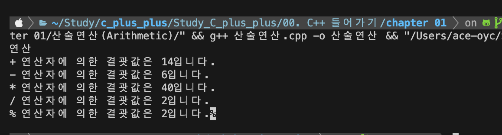
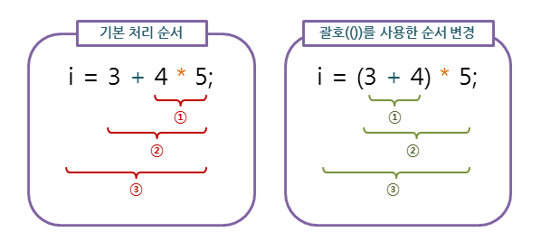
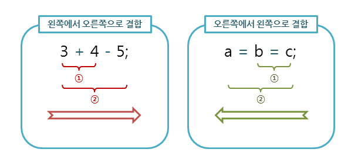
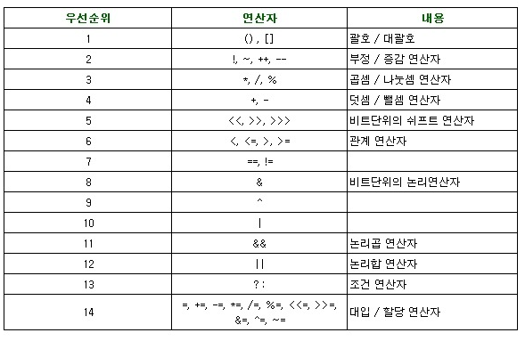

# 🤔 산술연산자(arithmetic operator)

산술 연산자는 사칙연산을 다루는 기본적이면서도 가장 많이 사용되는 연산자입니다.  
산술 연산자는 모두 두 개의 피연산자를 가지는 이항 연선자이며, 피연산자들의 결합 방향은 왼쪽에서 오른쪽입니다.

> 항이란 해당 연산의 실행이 가능하기 위해 필요한 값이나 변수를 의미합니다.
> 따라서 이항 연산자란 해당 연산의 실행을 위해서 두 개의 값이나 변수가 필요한 연산자를 의미합니다.

- `+` : 왼쪽의 피연산자에 오른쪽의 피연산자를 더함.
- `-` : 왼쪽의 피연산자에서 오른쪽의 피연산자를 뺌.
- `*` : 왼쪽의 피연산자에 오른쪽의 피연산자를 곱함.
- `/` : 왼쪽의 피연산자를 오른쪽의 피연산자로 나눔.
- `%` : 왼쪽의 피연산자를 오른쪽의 피연산자로 나눈 후, 그 나머지를 반환함.

```cpp
int num1 = 10;
int num2 = 4;

cout << "+ 연산자에 의한 결괏값은 " << num1 + num2 << "입니다." << endl;
cout << "- 연산자에 의한 결괏값은 " << num1 - num2 << "입니다." << endl;
cout << "* 연산자에 의한 결괏값은 " << num1 * num2 << "입니다." << endl;
cout << "/ 연산자에 의한 결괏값은 " << num1 / num2 << "입니다." << endl;
cout << "% 연산자에 의한 결괏값은 " << num1 % num2 << "입니다.";
```

**실습 사진**


## ⇲ 연산자의 우선순위(operator predence)와 결합 방향(associativity)

연산자의 우선순위는 수식 내에 여러 연산자가 함께 등장할 때, 어느 연산자가 먼저 처리될 것인가를 결정합니다.



연산자의 결합 방향은 수식 내에 우선순이가 같은 연산자가 둘 이상 있을 때, 먼저 어느 연산을 수행할 것인가를 결정합니다.



**연산자의 우선 순위**

