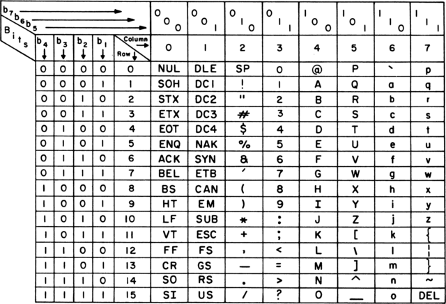

# 🤔 자료형(Types)

자료형은 **기본 자료형**과 **사용자 정의 자료형**으로 구분합니다. 표준 라이브러리로 제공되는 사용자 정의 자료형은 컴파일러에 의해 최적화되며 사용하기 편합니다.

## ⇲ 자료형에 대한 몇가지 용어 구분

- 리터럴(literal)이란 사전적 의미로는 문자 그대로 순서대로 표현 되어 있는 것을 말합니다.
  `x = 12.345'678`에서 `12.345'678`을 숫자 리터럴이라고 합니다.
  문자 리터럴(charactter literal)은 `"abc"`와 같이 `" "`를 사용하고 마지막에 `\0`을 포함합니다.
- 리터럴 자료형은 `constexpr` 변수로 `constexpr` 함수에서 `return` 되는 값의 자료형입니다.
- 컴파일 타임(compiling time)은 컴파일러가 소스 코드 해석하고 목적파일을 만들고 링커가 링킹하는 과정을 포함한다. 런타임(running time)은 실행 파일이 메모리에 로드되어 실행한 상태이다.

## 📄 기본 자료형(primitice data types)

하드웨어의 자원(resources)이 유한하기 때문에 프로그래밍 언어에서 사용하는 자료형으로 표현 가능한 수치 또한 유한합니다.

기본 자료형은 다음과 같습니다.

- bool(boolean, 1 byte)
- char(character, 1 byte)
- wchar_t(wide character, 4byte)
- int(integer, 4byte)
- double(double precision floating point number, 8 byte)
- void

### ⇲ bool

---

`bool` 자료형으로 정의된 변수는 `true`, `false`만 대입할 수 있습니다.  
조건문에서 0이 아니면 모두 참이 됩니다. 비교 연산자(<,>,...)의 반환값은 모두 `bool` 입니다.

### ⇲ char, wchar_t

---

`char` 자료형은 1byte 수치 자료이지만 ASCII 코드에 대응되는 문자 정보로 표현할 수 있습니다.



wchar_t는 wide character로써 UTF-8을 지원하며 국체화 문제를 다룰 수 있습니다.  
윈도우의 경우 wchar_t 타입은 2byte로 문자를 표현하는 UTF-16을 사용합니다.  
반면 리눅스의 경우 wchar_t 타입은 4바이트로 문자를 표현하는 UTF-32를 사용합니다.

### ⇲ int

---

32, 64bit 시스템 상관없이 `int` 자료형은 4byte입니다.  
64bit 시스템에서 `long`은 8byte 정수 자료형 입니다.

### ⇲ double

부동소수점(floating point numbers)을 표현하는 `float`, `double` 형식은 ISO/IEC/IEEE 60559, IEEE754 규정을 따릅니다. 이에 대해서는 01.01.04 부동 소수점 이해 부분에서 살펴본다.

## 📄 기본 자료형 정의와 초기화

변수를 정의하고 초기화하는 방법은 아래와 같다.

```cpp
int n = 0;
int n(0);
int n = {0};
int n{0};
```

각 자료형 변수 초기화를 하면 각 자료형의 크기만큼 스택 영역에 만들어 진다.

```cpp
// 64bit system
bool b = true;      // mov     BYTE PTR [rbp-1], 1          # 1 byte
char c = 'a';       // mov     BYTE PTR [rbp-2], 97         # 1 byte
int n = 0;          // mov     DWORD PTR [rbp-8], 0         # 4 byte (rbp-8 ~ 5까지)
long l = 0;         // mov     QWORD PTR [rbp-16], 0        # 8 byte
long long ll = 0;   // mov     QWORD PTR [rbp-24], 0        # 8 byte
double d = 0.;      // movsd   QWORD PTR [rbp-32], xmm0     # 8 byte
float f = 0.F;      // movss   DWORD PTR [rbp-36], xmm0     # 4 byte
```

## 📄 const(constant)

const는 **언제든 변할 수 있는 객체를 불변으로 정의하는 예약어** 입니다.  
상수는 두 가지로 구분됩니다. 리터럴 상수와 정의된 상수입니다. 리터럴은 수치형, 문자형이 있으며 정의된 상수는 변수 정의 시 `const int n = 10;`와 같이 `const`를 사용하며 객체도 동일하게 적용됩니다.

`const`는 `int const nNUml`와 같이 왼쪽에 표현된 자료형에 적용되는 것이 기본입니다.  
하지만 `const int nNum;` 같이 예외가 허용되며 예이 표현을 더 많이 사용합니다.

`const int * p1`와 `int const * p1`는 같습니다. 즉 `p1`이 지정하는 `int`값을 변경할 수 없지만, p1은 다른 주소를 지정할 수 있습니다.

```cpp
int const * p1 = new int;  // 또는 const int * p1 = new int;
*p1 = 10; // error
delete p1;
p1 = new int; // ok
```

아래와 같은 경우 `p2`가 지정하는 `int`의 값은 변경할 수 있지만, p2는 다른 주소를 지정할 수 없습니다.

```cpp
int * const p2 = new int;
*p2 = 10; // ok
delete p2;
p2 = new int; // error
```

참조자는 별칭으로 사용되는 것이기 때문에 정의 시 초기화 해야 합니다.  
`const`는 앞서 언급한 포인터 자료형의 `const` 지정 방법과 동일합니다.  
한 가지 주의할 점은 `int& ref = 10;`과 같이 리터럴을 그대로 사용할 수 없습니다.
사용하기 위해서는 `const`로 정의 해야 합니다.

## 📄 static, extern

---

C++에서 `static`은 사용자 정의 자료형의 멤버함수와 맴버변수에 사용하는 것과 컴파일 중 링킹(linking) 과정에 내부, 외부 링크를 위한 용도가 있습니다.

사용자 정의 자료형의 `static` 멤버함수는 객체가 아니지만 사용자 정의 자료형에 속합니다.  
이는 `static 멤버변수도 객체에 속하지 않고 객체외부에 단 하나만 존재합니다.

1. 정적 변수(Static Variables) : 클래스 내부의 멤버 변수로 선언될 때, 해당 변수는 클래스의 모든 인스턴스가 공유하는 변수가 됩니다.
   즉, 클래스의 여러 인스턴스에서 동일한 변수를 공유하여 사용할 수 있습니다.
   정적 변수는 클래스의 인스턴스를 만들지 않아도 상용할 수 있으며, 클래스 이름을 통해 접근할 수 있습니다.

   ```cpp
   class MyClass {
    public:
        static int myStaticVariable;
    };

    int MyClass::myStaticVariable = 0; // 정적 변수 초기화

    // 사용 방법
    MyClass::myStaticVariable = 10;
   ```

2. 정적 함수(Static Functions): 클래스의 정적 멤버 함수는 특정 객체의 인스턴스에 속하지 않고 클래스 자체에 속하는 함수입니다. 이 함수는 클래스의 인스턴스를 생성하지 않아도 호출할 수 있습니다.

```cpp
class MyClass {
public:
    static void myStaticFunction() {
        // ...
    }
};

// 사용 방법
MyClass::myStaticFunction();
```

**extern**

```cpp
extern int n; // 선언
int n = 3;  // 정의
```

`extern int n = 3;` 같이 선언하는 동시에 초기화를 할 수 도 있는데, 이런 경우 전역 변수를 정의 되기 때문에 `extern`은 필요없습니다.

그리고, 함수 내에서 `static`으로 지정한 변수는 그 함수만 사용할 수 있는 전역 변수와 같습니다.  
즉, 특정 영역안에서만 값을 유지하는 지역변수를 만드는 것입니다.

## 📄 사용자 정의 자료형(user defined types)

사용자 정의 자료형은 `enum`, `struct`, `class` 등을 이용하여 만들 수 있습니다.

```cpp
enum {eID_NUM, eID_NAME};

enum class COLOR { RED, GREEN, BLUE };

class MyClassType {
  public:
    MyClass() = default;
    ~MyClass() = default;
    int nID_;
};

struct MyStructType {
  int nNumber;
  std::string strName;
};

MyClassType MyClass;
MyStructType MyStruct;
int nNumber = eID_NUM;
COLOR Color = COLOR::RED;
```

## 📄 typedef, using

모든 자료형은 다른 별칭을 만들어 사용할 수 있습니다. `typedef`와 `using`을 사용하면 직접 자료형의 별칭을 만들 수 있습니다. API, Library를 만든다면 고유 자료형의 별칭을 이용하는 것이 좋습니다.

```cpp
typedef unsigned int uint;
using uchar = unsigned char;

uint n;
uchar uch;
```

`typdef`란 말 그대로 자료형(type)를 정의 하는 것(define)입니다.  
int나 flaot 같은 자료형을 내가 원하는 대로 정의 할 수 있습니다.

타입의 이름에 대한 별칭을 생성하는 데 사용됩니다. 즉, struct나 class에 대해서만 사용 가능합니다.

`using`이란 Typedef와 다르게 타입뿐만 아니라 변수, 함수, 템플릿 등 모두 별칭 생성이 가능합니다.

## 📄 자료형 변환(type casting)

**C언어 스타일**

```c
int n = (double)1.5;        // C Style
```

```cpp
const_cast<new_type>(expression)        // 상수화 상태를 일시 해제한다. 그렇다고 상수를 변경할 수 있는 것은 아니다.
static_cast<new_type>(expression)       // 정적 변환으로 기본 자료형을 변환한다.
reinterpret_cast<new_type>(expression)  // 포인터 자료형을 다른 포인터 자료형으로 변환한다.
dynamic_cast<new_type>(expression)      // 상속 구조를 갖고 있는 객체의 포인터를 상위 또는 하위 자료형으로 변환한다.

```
