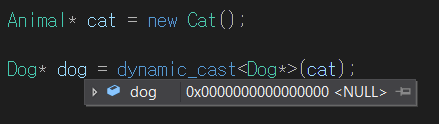
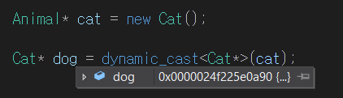

# 📄 형변환(type conversion)

```
1. static_cast
2. const_cast
3. reinterpret_cast
4. dynamic_cast
```

형변환(type conversion)은 캐스팅(casting)이라고도 하며 명시적(explicit) 또는 묵시적(implicit)으로 자료의 형식을 변환하는 것을 말합니다.  
자료형에 대한 이해가 부족한 경우 형변환을 아무 생각 없이 사용하는 경향이 있습니다.
C++에서 잘못된 형변환은 시스템 전반에 영향을 끼친다는 것을 기억해 둬야 합니다.

구문(syntax)은 다음과 같다.

```lua
1. (new_type) expression
2. new_type (expression)
3. new_type (arg1, args,...)
4. new_type()
5. new_type
```

C 스타일의 형변환은 아래와 같이 사용된다.

```c
double d = 3.141592;
int n = (int)d;
```

C++에서 일반적으로 자료형에 대한 형변환은 네 가지 방식을 구분하여 사용할 수 있다.

```cpp
static_cast<new_type>(value);        ///< 형변환 방법을 컴파일러가 아는 경우

const_cast<new_type>(value);         ///< 일시적으로 const 지정 또는 해제

reinterpret_cast<new_type>(value);   ///< 자료를 재해석하여 형변환하는 것으로 주로 포인터형에 사용

dynamic_cast<new_type>(value);       ///< 상속 관계 중 다형성을 사용할 수 있는 경우 up, down 형변환
```

형변환의 반환형은 new_type입니다. 형변환은 대상에 따라 변환 할 수 없는 것이 있습니다.  
예로 사용자 정의 자료형에 형변환 연산자(user-defined type conversion function)를 정의하지 않으면 형변환 방법에 따라 다른 자료형으로 형변환 할 때 문제가 발생 할 수 있습니다.

C 스타일로 하여도 되지만 C++ 형변환 방식을 용도에 맞게 사용하는 것이 낫습니다.  
C 스타일은 클래스와 상속 관계 등의 구조로 만들어진 객체의 형변환을 컴파일 타임에 보증할 수 없기 때문에 런타임에 어떤 문제가 발생할지 알 수 없습니다.

## ♺ 1. static_cast

**정적 캐스트** 보통 정적이라 함은 언어에서 **컴파일시** 에~ 동적이라함은 **런타임시** 에~ 를 의미합니다.  
즉, **<u>static_cast 연산자를 통해 형변환을 하면 컴파일(정적) 타임에 형변환이 가능한지 검사</u>** 합니다.  
기본 자료형간의 형변환도 혀용하며, 이 때 최대한 값을 유지합니다.  
👉 이진수 표기또한 달라질 수 있습니다 (float -> int 등)

🤔 그렇다면 **static_cast** 어떻게 작성해야 되는건가?

```cpp
#include <iostream>

int main() {
    int num = 10;
    double convertedNum = static_cast<double>(num); // int를 double로 변환

    std::cout << "정수: " << num << std::endl;
    std::cout << "부동 소수점 숫자: " << convertedNum << std::endl;

    return 0;
}
```

다음과 같이 작성할 수 있습니다. `static_cast<double>(num)`은 `num`이라는 정수를 부동 소수점 숫자로 변환합니다.  
이렇게 하면 소수점 이하 값을 유지한 채로 `convertedNum`에 할당됩니다.

static_cast 연산자는 일반적으로 4가지 형변환 연산자 중 **가장 사용빈도가 높습니다.**

- 다른 형변환 연산자와는 달리 기본 자료형의 형변환을 허용하므로
- 밑에서 설명할 dynamic cast는 기본 자료형간의 형변환이 불가능하고 static_cast에 비해 성능이 떨어짐
- reinterpret_cast와 const_cast는 사용예제가 다름

## ♺ 4. const_cast

- 이 형변환 연산자는 다른 자료형으로 바꿀수는 없습니다.
- const 또는 volatile이 붙은 자료형의 속성을 제거할 때 사용됩니다.

```cpp
int main()
{
    const char* any = "Hello";
    char* temp = const_cast<char*>(any);

    Animal* myAnimal = new Animal();
    const Animal* cstPtr = myAnimal;
    Animal* ptr = const_cast<Animal*>(cstPtr);

    delete myAnimal;

    return 0;
}
```

const라는 의미는 객체가 변하지 말아야 한다는 코드작성자의 의도를 컴파일러와 다른 사람에게 알려주는 유용한 수단이므로 const_cast를 이용하여 const 속성을 제거하는건 옳지 못합니다.
다만 라이브러리의 함수 인자가 const 기능이 없고 const 속성이 존재하는 변수를 넘기지 못하는 경우

```cpp
void LibFunc(char* ptr) { ~~~ }

void MyFunc(const char* ptr)
{
    LibFunc(const_cast<char*>(ptr));
}
```

_(간단한 예시)_  
위와 같은 예시가 아니라면 const를 해제하는 일은 가급적 자제해야 합니다.

## ♺ 3. reinterpret_cast

이 형변환 연산자는 일반적으로 **허용하지 않는 형변환**을 강제적으로 형변활 때 사용됩니다.

- 포인터/참조와 관련된 형변환만 지원한다.
- 연관없는 두 포인터 형 사이의 변환을 허용
- 이름에서 알 수 있듯이 말 그대로 재해석(reinterpret)한다고 볼 수 있습니다.

🤔 그렇다면 **reinterpret_cast** 어떻게 작성해야 되는건가?  
예시를 들어보자면 `int`와 `float`의 크기가 서로 다르기 때문에 `int` 포인터를 `float`포인터로 `reinterpret_cast`로 변환하는 경우를 작성해보도록 하겠습니다.

```cpp
#include <iostream>

int main() {
    int intValue = 10;
    int *intPtr = &intValue;

    // int 포인터를 float 포인터로 reinterpret_cast로 변환
    float *floatPtr = reinterpret_cast<float*>(intPtr);

    // intValue의 값을 변환된 float 형식으로 해석하여 출력
    std::cout << "intValue: " << intValue << std::endl;
    std::cout << "Interpreted as float: " << *floatPtr << std::endl;

    return 0;
}
```

위의 코드는 `int` 변수 `intValue`의 주소를 `intPtr`에 저장하고, 이를 `reinterpret_cast`를 사용하여 `float` 포인터인 `floatPtr`로 변환합니다.  
그러나 주의할 점은 `intValue`의 값을 `float`로 해석하기 때문에 결과가 의미가 없을 수 있습니다.

## ♺ 4. dynamic_cast

- static_cast와 달리 컴파일 시점이 아닌 런타임시에 형변환을 검사하여 형변환을 보다 안전하게 처리합니다.

👉 실행중에(런타임) 자료형을 판단  
👉 포인터 또는 참조형을 캐스티할 때만 사용가능  
👉 정확히는 부모 클래스와 자식 클래스간의 변환에 사용됩니다. (실패시 0을 반환)  
👉 하나 이상의 `virtual` 함수가 존재해야 합니다.  
👉 호환되지 않는 자식형으로 캐스팅하려면 NULL 반환(다운 캐스팅 SAFE)

```cpp
class Animal
{
public:
    Animal() { }
    virtual ~Animal() { }
};

class Cat : public Animal
{
public:
    Cat() { }
    ~Cat() { }
};

class Dog : public Animal
{
public:
    Dog() { }
    ~Dog() { }
};

int main()
{
    Animal* cat = new Cat();

    Dog* dog = dynamic_cast<Dog*>(cat);
    delete cat;
}
```

위와 같이. cat객체를 생성하고 그 객체를 Animal타입이 가르키고 있을 때 자식으로 형변환하는 경우.  
cat포인터 변수가 가르키고 있는것은 Cat객체. dynamic_cast를 통해 Dog\*로 형변환할 시


NULL을 반환합니다.  
제대로 Cat으로 형변환을 할 시  

다음과 같이 형변환이 안전하게 가능해집니다.

[<a href="https://marmelo12.tistory.com/291">출처</a>]
